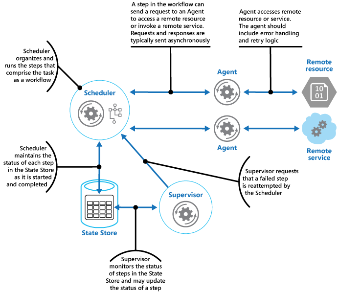

Table of content

- [Project Introduction](#project-introduction)
  - [Assumptions](#assumptions)
  - [Goals](#goals)
  - [Features](#features)
- [Development Process](#development-process)
  - [Architecture overview](#architecture-overview)
    - [Microsoft Orleans and the **Actor Model**](#microsoft-orleans-and-the-actor-model)
    - [My Understanding of the Actor model](#my-understanding-of-the-actor-model)
    - [Actor model in Microsoft Orleans](#actor-model-in-microsoft-orleans)
    - [Primitives in Microsoft Orleans](#primitives-in-microsoft-orleans)
      - [Grain](#grain)
      - [Silo](#silo)
      - [Client](#client)
      - [Persisted State](#persisted-state)
      - [Streams](#streams)
  - [Application Components](#application-components)
    - [Presentation Layer](#presentation-layer)
    - [Microsoft Orléans](#microsoft-orléans)
    - [Abstractions layer](#abstractions-layer)
  - [Workflow and Rule Engine](#workflow-and-rule-engine)
    - [Potiential Design Patterns](#potiential-design-patterns)
      - [Scheduler Agent Supervisor](#scheduler-agent-supervisor)
  - [Real-time Monitoring](#real-time-monitoring)
  - [Reporting and Analytics](#reporting-and-analytics)
  - [Integration Capabilities:](#integration-capabilities)
  - [Scalability and Customization](#scalability-and-customization)


# Project Introduction

## Assumptions

This project **will**:
- Be mainly developed in C# with Microsoft .Net Core 8.0 and above.
- Overall architecture will leverage Microsoft Orleans Framework 7.0 and above.
- Extensively use of asyncronous messaging systems (queue, stream, cqrs, eventing...)
- Software architecture best practices (design patterns, TDD, QA...).
- Using [FOSS](https://itsfoss.com/what-is-foss/) (Free/Libre Open Source Software) technologies as much as possible.

## Goals

## Features

Key features of our Manufacturing Execution System include:

- Workflow Engine: Our system comes with a robust workflow engine that allows you to define and manage complex manufacturing processes. You can easily create and modify workflows, assign tasks to different teams or individuals, and track the progress of each step.

- Rule Engine: The rule engine enables you to define and enforce business rules and logic within your manufacturing processes. You can set up rules to validate inputs, trigger actions based on specific conditions, and ensure compliance with industry standards and regulations.

- Real-time Monitoring: Our system provides real-time monitoring capabilities, allowing you to track the status of your manufacturing processes at any given time. You can view live dashboards, monitor key performance indicators (KPIs), and identify bottlenecks or issues that may impact production efficiency.

- Reporting and Analytics: Generate comprehensive reports and gain valuable insights into your manufacturing operations. Our system offers built-in analytics tools that allow you to analyze historical data, identify trends, and make data-driven decisions to optimize your processes.

- Integration Capabilities: Seamlessly integrate our Manufacturing Execution System with your existing enterprise systems, such as ERP (Enterprise Resource Planning) or MES (Manufacturing Execution System). This ensures data consistency and enables end-to-end visibility across your organization.

- Scalability and Customization: Our system is designed to scale with your business needs. Whether you have a small manufacturing facility or a large enterprise, our solution can adapt to your requirements. Additionally, we offer customization options to tailor the system to your specific workflows and business processes.

# Development Process

## Architecture overview

### Microsoft Orleans and the **Actor Model**

Orleans is based on the "actor model". The actor model originated in the early 1970s and is now a core component of Orleans. The actor model is a programming model in which each actor is a lightweight, concurrent, immutable object that encapsulates a piece of state and corresponding behavior. Actors communicate exclusively with each other using asynchronous messages. Orleans notably invented the Virtual Actor abstraction, wherein actors exist perpetually.

Actors are purely logical entities that always exist, virtually. An actor cannot be explicitly created nor destroyed, and its virtual existence is unaffected by the failure of a server that executes it. Since actors always exist, they are always addressable.

This is a novel approach to building a new generation of distributed apps for the Cloud era. The Orleans programming model tames the complexity inherent to highly parallel distributed apps without restricting capabilities or imposing constraints on the developer.

For more information, see [Orleans: Virtual Actors](https://www.microsoft.com/research/project/orleans-virtual-actors) via Microsoft Research. A virtual actor is represented as an Orleans grain.

__Reference taken from [Microsoft Orleans Getting Started](https://learn.microsoft.com/en-us/dotnet/orleans/overview)__

### My Understanding of the Actor model


Actors are logical entities like a User or Mailbox, actors can communicate exclusively 
asynchroneously by exposing action (method) and might have state that can be persisted or not. 


Asynchroneous call are represented by methods declared on an Actor.


For example a User Mailbox could use the actor model like this:
- SetUnreadMessageCount(int count): this method update the internal unread messages count state of a User actor 
entity, this method can be called by other Actor who need to do such operation (ex: the user mailbox).
- GetMessages(int status): this method retrieve messages for a given status (ex: unread) from the mailbox storage (Actor) 


So each User and Mailbox will play there role as Actor, they will be a logical representation in memory and will be availlable when needed.

When a user attempt to retrieve his mail, the actors will be active and go through their lifecycle to get activated and load there state.

As soon the user is done, all the actors become idle to free up resources.

### Actor model in Microsoft Orleans

In orleans the actor model is represented as a Grain, a grain is virtual actor. A grain is a fundamental building block of any Orleans application. Grains are entities comprising:
- User-defined identity
- Behavior
- State


### Primitives in Microsoft Orleans

#### Grain

A Grain is the core primitive of the Orleans framework, representing an individual actor. Grains are logical units of computation and state encapsulation. They are designed to be lightweight and can be created and destroyed dynamically. Each Grain has a unique identity and can hold state that can be persisted across activations. Grains communicate with each other using asynchronous messages, ensuring high scalability and fault tolerance.

#### Silo

A Silo is the runtime container for Grains. It is responsible for hosting and managing the lifecycle of Grains, including their activation, deactivation, and state persistence. Silos handle the distribution of Grains across multiple nodes in a cluster, providing load balancing and fault tolerance. They also manage the communication between Grains and ensure that messages are delivered reliably.

#### Client

The Client in Orleans is the component that interacts with the Grains from outside the Silo. It provides a way for external applications to send messages to Grains and receive responses. Clients can be any application that needs to interact with the Orleans cluster, such as web applications, mobile apps, or other services. The Client communicates with the Silo using a well-defined protocol, ensuring secure and efficient message exchange.

#### Persisted State

Persisted State in Orleans refers to the ability of Grains to save their state to a durable storage medium. This ensures that the state of a Grain can be recovered even after a failure or restart. Orleans provides built-in support for various storage providers, such as Azure Table Storage, SQL Server, and more. Developers can define the state schema for their Grains and use the provided APIs to read and write state data.

#### Streams

Streams in Orleans are a powerful mechanism for enabling real-time, event-driven communication between Grains. They allow Grains to publish and subscribe to events, facilitating decoupled and reactive architectures. Streams can be used to implement complex workflows, event sourcing, and real-time analytics. Orleans supports various stream providers, including in-memory streams, Azure Event Hubs, and Kafka, allowing for flexible and scalable event processing.

## Application Components

```
---------------------------------------------------------------------
|                     Presentation Layer                            |
---------------------------------------------------------------------
---------------------------------------------------------------------
|                      Microsoft Orlêans                            |
---------------------------------------------------------------------
---------------------------------------------------------------------
|                      Abstraction Layer                            |
---------------------------------------------------------------------
|  ----------------- ------------------- -------------------------  |
|  |     Security  | |   Persistence   | |    Execution Runtime  |  |
|  ----------------- ------------------- -------------------------  |
|  | OAuth / OpenID| | SQLServer/PGSQl | | Kubernetes / Docker   |  |
|  |     ....      | |    NoSQL...     | |     OpenFaaS ...      |  |
|  ----------------- ------------------- -------------------------  |
|                                                                   |
---------------------------------------------------------------------
```

### Presentation Layer

This layer is responsible to provide a user interface to interact with the system, we will stay in the .Net ecosystem like:
- .Net Core MVC
- .Net Core Razor Pages
- .Net Blazor WASM

### Microsoft Orléans

Orléans will play the role of the bussiness logic / domain model

### Abstractions layer 

This layer will provide essentials aspects of the application like security, persistence, platform execution.

## Workflow and Rule Engine

### Potiential Design Patterns

#### Scheduler Agent Supervisor



> TODO

## Real-time Monitoring

> TODO

## Reporting and Analytics

> TODO

## Integration Capabilities:

> TODO

## Scalability and Customization

> TODO